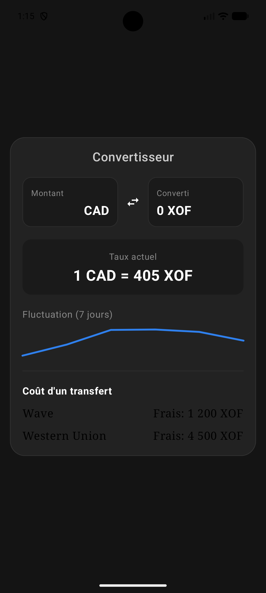

# rate-exchange — Convertisseur CAD / XOF

Application Android de conversion entre le dollar canadien (CAD) et le franc CFA (XOF), conçue pour la diaspora africaine au Canada.

## Fonctionnalités

- Conversion CAD ↔ XOF en temps réel
- Inversion de la paire de devises en un clic
- Taux mis en cache localement pendant 24h (pas d'appel réseau inutile)
- Graphique de fluctuation du taux sur les 7 derniers jours
- Affichage des frais de transfert Wave et Western Union

## Stack technique

- Kotlin / Jetpack Compose
- Architecture MVVM
- Retrofit + API Frankfurter
- DataStore Preferences (cache 24h)
- StateFlow

## Installation

1. Clone le repo : `git clone https://github.com/adamdrabo/rate-exchange.git`
2. Ouvre le projet dans Android Studio
3. Lance sur un émulateur ou un appareil physique